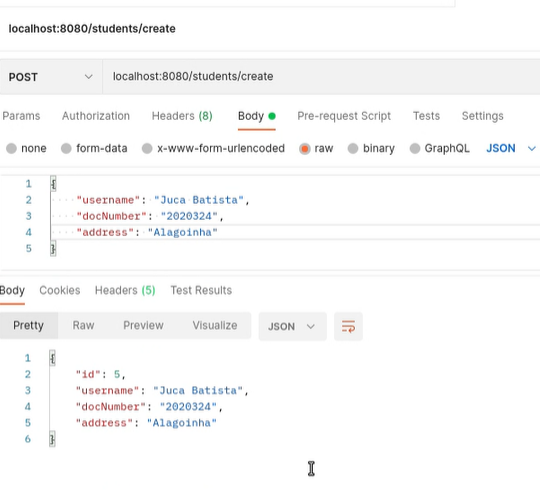
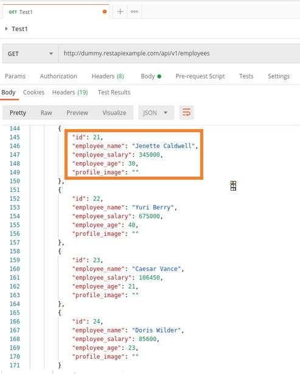
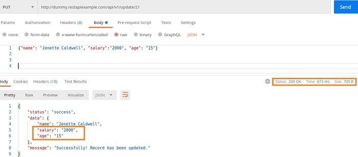
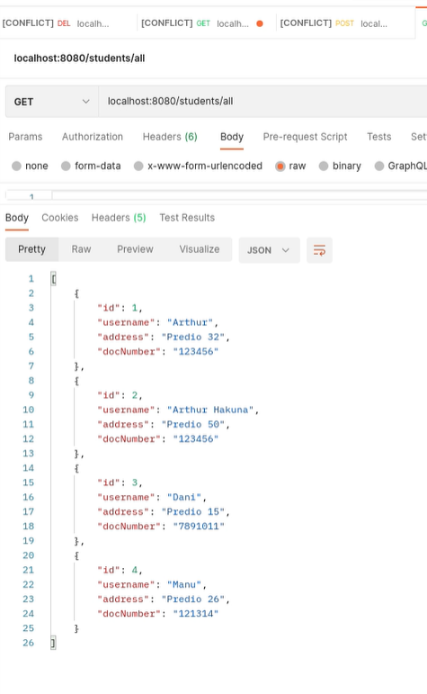
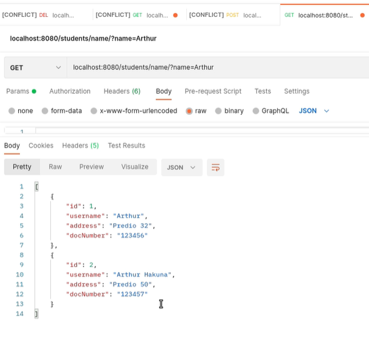
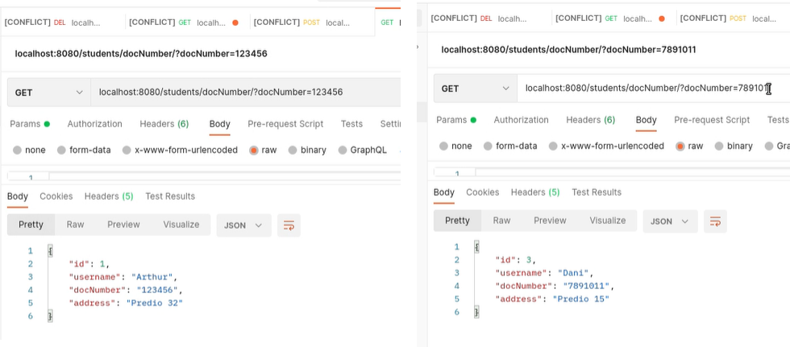

# Grupo 1

## Spring Boot
## O que é
O Spring Boot é um framework Java open source que fornece suporte abrangente de infraestrutura para o desenvolvimento de aplicativos Java. Tem como objetivo facilitar esse processo em aplicações Java. Consequentemente, ele traz mais agilidade para o processo de desenvolvimento, uma vez que devs conseguem reduzir o tempo gasto com as configurações iniciais.
Em sua essência, o Spring lida com a infraestrutura para que você possa se concentrar em seu aplicativo oferecendo um contêiner, geralmente chamado de contexto do aplicativo Spring, que cria e gerencia os componentes do aplicativo. Esses componentes, ou beans, são conectados dentro do contexto do aplicativo Spring para fazer um aplicativo completo  a nível de produção.

#### Características
- Crie aplicativos Spring independentes
- Incorpore Tomcat, Jetty ou Undertow diretamente (sem necessidade de implantar arquivos WAR);
- Forneça dependências 'starter' opinativas para simplificar sua configuração de compilação;
- Configure automaticamente bibliotecas Spring e de terceiros sempre que possível;
- Forneça recursos prontos para produção, como métricas, verificações de integridade e configuração externa;
- Absolutamente nenhuma geração de código e nenhum requisito para configuração XML.

Portanto, o Spring Boot é uma maneira eficiente e eficaz de criar  uma aplicação em Spring e facilmente colocá-la no ar, funcionando sem depender de um servidor de aplicação.

## Como Funciona Internamente
O Spring possui uma arquitetura baseada em interfaces e POJOs (Plain Old Java Objects), oferecendo aos POJOs características como mecanismos de segurança e controle de transações. Esse recurso se aplica ao modelo de programação Java SE e ao Java EE total e parcial. Também facilita testes unitários e surge como uma alternativa à complexidade existente no uso de EJBs. Ademais, Spring codifica padrões de design formalizados como objetos de primeira classe que podemos integrar em nossos próprios aplicativos.

O Spring Framework consiste em recursos organizados em cerca de 21 módulos. Esses módulos são agrupados em 7 grupos: 

#### Core Container
O Core Container consiste nos módulos Core, Beans, Context e Expression Language. 
Dentro do grupo Core Container, estão os módulos responsáveis por conter as partes fundamentais do framework, como as classes básicas e avançadas, suas implementações e controle das definições em tempo de execução das configurações por anotações ou arquivos XML. 

#### Data Access/Integration
A camada Acesso/Integração de Dados consiste nos módulos JDBC, ORM, OXM, JMS e Transação.
O módulo Data Access/Integration é o responsável por prover funcionalidades para transações com o banco de dados. O módulo Web contém os recursos para uma aplicação web, como a implementação do MVC, Web Services REST, entre outros. 

#### Web
O módulo Web do Spring fornece recursos básicos de integração orientados à web, neste contém os recursos para uma aplicação web, como a implementação do MVC, Web Services REST, entre outros. A camada da Web consiste nos módulos Web, Web-Servlet, Web-Struts e Web-Portlet. 
- O módulo Web-Servlet contém a implementação do model-view-controller (MVC) do Spring para aplicativos da web;
- O módulo Web-Struts contém as classes de suporte para integrar uma camada da web Struts clássica em um aplicativo Spring;
- O módulo Web-Portlet fornece a implementação MVC para ser usada em um ambiente de portlet e espelha a funcionalidade do módulo Web-Servlet.

#### Aspect Oriented Programming (AOP)
O módulo AOP fornece a implementação para programação orientada a aspectos, permitindo que você defina, por exemplo, interceptadores de método e pontos de corte para desacoplar de maneira limpa o código que implementa a funcionalidade que deve ser separada.

#### Instrumentation
o módulo Instrumentation fornece suporte a instrumentação de classe e implementações de carregador de classe para serem usados em determinados servidores de aplicativos.

#### Messaging 
O módulo  Messaging contém implementação e suporte para programação baseada em mensagens. 

#### Test
O módulo Test possui o suporte para os testes unitários utilizando JUnit e testes de integração. Todos os módulos citados acima, com exceção do módulo Test, são construídos sobre o Core Container do Spring Framework.

<br>
<p align="center">
  
 
 <p align="center">Figura 1: Projeto Spring Framework destacando o módulo Core Container</p>
</p>


#### Arquitetura	do	Spring	Boot
O Spring Boot veio como uma extensão do Spring, que utiliza da base do Spring Framework para iniciar uma aplicação de uma forma bem mais simplificada, diminuindo a complexidade de configurações iniciais e o tempo para executar uma aplicação e deixá-la pronta para implementação das regras de negócio. Também já traz um servidor embutido que facilita ainda mais esse processo de start da aplicação.

A	arquitetura	do	Spring	Boot	é	formada	pelos	componentes:

- CLI - o	Spring	Boot CLI é uma ferramenta de linha de  comando que facilita a criação de protótipos através de scripts em Groovy;
- Starters - é um conjunto de componentes de dependências que podem ser adicionados aos nossos sistemas;
- Autoconfigure - configura automaticamente os componentes carregados;
- Tools - é uma IDE customizada para o desenvolvimento com Spring Boot;
- Samples - dezenas de implementações de exemplos disponíveis para uso.
<br>
<p align="center">
  
  
 
 <p align="center">Figura 2: Arquitetura do pring Boot</p>
</p>


Resumindo, o Spring Boot é a soma do Spring Framework com um servidor embutido menos as configurações XML e classes de configurações.
<br>
<p align="center">
  
 
 <p align="center">Figura 3: Resumo Spring Boot</p>
</p>


Embora o Spring forneça integração e suporte para uma grande variedade de ferramentas corporativas e externas, ele intencionalmente mantém suas dependências obrigatórias em um mínimo absoluto. O ato de conectar beans juntos é baseado em um padrão conhecido como injeção de dependência (DI). Em vez de os componentes criarem e manterem o ciclo de vida de outros beans dos quais dependem, um aplicativo com injeção de dependência depende de uma entidade separada (o contêiner) para criar e manter todos os componentes e injetá-los nos beans que precisam deles. Isso é feito normalmente por meio de argumentos de construtor ou métodos de acesso de propriedade.

Como o projeto Spring Framework possui o módulo Core Container, onde está implementado a Inversão de Controle que utiliza da Injeção de Dependência, ele se torna o projeto essencial para iniciar uma aplicação sendo assim a base de toda a plataforma Spring.


## Controller Rest
### O que é
- Controllers REST são utilizados para a criação de aplicações web baseados no padrão REST;
- Um controller ou controlador, é o responsável por receber requisições de fora do sistema e devolver respostas de acordo com as requisições;
### Anotações e Parâmetros das Anotações
- @RestController -> Responsável por dizer que determinada classe irá manipular requisições HTTP;
- @RequestMapping(<partial_url>) -> Os métodos de seu controlador serão mapeados para URLs de acordo com a url parcial dentro da anotação;
    - @RequestMapping("/users/") -> indica que é responsável por atender requisições que contenham "/users/" em sua url;
#### Anotações de Requisição para métodos do Controller:
- @GetMapping(path) -> Indica que a requisição é do tipo GET;
- @PostMapping(path) -> Indica que a requisição é do tipo POST;
- @PutMapping(path) -> Indica que a requisição é do tipo PUT;
- @DeleteMapping(path) -> Indica que a requisição é do tipo DELETE;
- Todos estes métodos possuem path concatenado ao @RequestMapping, portanto "/users/"+path;
---
- @RequestParam <Type> -> Indica que o tipo será indicado na url juntamente ao seu RequestMapping+TipoGetting+RequestParam
    - Exemplo: "/users/getUser?id=123" -> Uma requisição do tipo get, de users, e enviando parametro id = 123;
- @PathVariable <Type> -> Similar ao RequestParam, porém utilizará uma URL diferente;
    - Exemplo: "/users/getUser/123"
#### Anotações de Resposta para métodos do controller:
- @ResponseBody -> Indica que o método irá retornar uma resposta HTTP;
- @ExceptionHandler(<Exception>.class) -> Configuração de resposta para caso um erro ocorra;
- @ResponseStatus(HttpStatus.<status>) -> Configura uma resposta de status para retorno de sua requisição;

### Exemplos
- Exemplo de criação de um controller:
```Java
@RestController
@RequestMapping("/users")
public class MyRestController {

    private final UserRepository userRepository;
    private final CustomerRepository customerRepository;

    public MyRestController(UserRepository userRepository, CustomerRepository customerRepository) {
        this.userRepository = userRepository;
        this.customerRepository = customerRepository;
    }

    @GetMapping("/{userId}")
    public User getUser(@PathVariable Long userId) {
        return this.userRepository.findById(userId).get();
    }

    @GetMapping("/{userId}/customers")
    public List<Customer> getUserCustomers(@PathVariable Long userId) {
        return this.userRepository.findById(userId).map(this.customerRepository::findByUser).get();
    }

    @DeleteMapping("/{userId}")
    public void deleteUser(@PathVariable Long userId) {
        this.userRepository.deleteById(userId);
    }
}
```
- Exemplo de controlar exceções:
```JAVA
class EmployeeNotFoundAdvice {

  @ResponseBody
  @ExceptionHandler(EmployeeNotFoundException.class)
  @ResponseStatus(HttpStatus.NOT_FOUND)
  String employeeNotFoundHandler(EmployeeNotFoundException ex) {
    return ex.getMessage();
  }
}
```
---
### Construtores, Acessores e Modificadores Necessários (Zé)
Os modelos de métodos construtores no spring seguem o mesmo formato do Java, porém normalmente é utilizado o conceito de injeção de dependencia.

Portanto a única mudança é a atribuição de uma anotação a mais na estrutura já conhecida de construtores:

#### Exemplo
_Anotação no atributo_
```Java
@Controller
public class MeuController {

    @Autowired
    private UmDao dao;
}
```
_Anotação no construtor_
```Java
@Controller
public class MeuController {

    private UmDao dao;

    @Autowired
    public MeuController(UmDao dao) {
        this.dao = dao;
    }
}
```

Acerca dos métodos acessores e modificadores, normalmente é utilizada uma depêndencia responsável por "enxutar" a nossa classe rest.

Utilizando a Lombok, conseguimos através de anotações definir diversos métodos que normalmente toda classe vai possuir, como getters, setters, equals e hashcode.

#### Exemplo

```Java
package com.mballem.lombok;

import lombok.EqualsAndHashCode;
import lombok.Getter;
import lombok.Setter;
import lombok.ToString;

@ToString
@EqualsAndHashCode
public class User {

	@Getter @Setter
	private Integer id;
	
	@Getter @Setter
	private String name;
} 
```


### Mapeamento de Verbos

Os quatro verbos mais comuns são GET, PUT, DELETE e POST.

O método HTTP GET busca um registro ou conjunto de recursos do servidor sem alterar nenhum recurso. É seguro e idempotente. 

O método HTTP PUT atualiza ou substitui o registro fornecido ou para criar uma nova entidade em uma URL conhecida. O método PUT HTTP é idempotente então várias solicitações de PUT idênticas com a mesma entidade para a mesma URL gera o mesmo resultado como se apenas uma solicitação PUT fosse emitida.

O método HTTP DELETE remove um recurso em uma URL específica.

O método HTTP POST é usado para enviar uma entidade para o recurso especificado, geralmente causando uma mudança no estado ou no servidor. 

O método HTTP OPTIONS busca todas as operações REST disponíveis.

O método PATCH é semelhante ao PUT, exceto que não substituirá o registro inteiro. PATCH, corrige a coluna que está sendo modificada[(Packt)](https://subscription.packtpub.com/book/web-development/9781788294287/1/ch01lvl1sec9/rest-verbs-and-status-codes).

### Exemplos

*POST:* Por exemplo, um administrador emite uma solicitação POST para um recurso de /students que cria um estudante com um username, docNumber e address.



*PUT:* No exemplo abaixo, temos um sistema de funcionarios e o PUT irá atualizar os dados da Janette.





*GET:* Pode user utilizado para pegar um registro especifico ou dentro de algum filtro, nas imagens abaixo estão exemplos para receber os dados de todos os estudantes, para receber os dados de todos que conten X no nome e para receber apenas o que tem exatamente aquele número de matrícula;







*DELETE:* No exemplo abaixo será deletado os dados do funcionário Garret Winters de ID 2.


e caso o delete falhe:


---
### Como Receber Dados da Chamada (Manu)
### Como Retornar Dados e Status (Manu)
### Classes e Métodos Adicionais

O protocolo HTTP funciona a partir de clientes que enviam solicitações aos servidores e esses, por sua vez, respondem às solicitações. Fazemos operações CRUD (Create, Read, Update, Delete) enviando solicitações HTTP com diferentes métodos, às vezes chamados de verbos HTTP. GET e POST são os métodos HTTP usados ​​com mais frequência, como explicado anteriormente, mas existem diversos outros métodos HTTP interessantes.

### Classe de métodos do tipo HTTP seguro

Um método seguro é um método que não altera dados no servidor. Por exemplo, **GET**, **OPTIONS** e **HEAD** são métodos seguros, uma vez que o usuário, ou um aplicativo, não causam efeitos colaterais no servidor ao chamá-los. Todos os métodos seguros também são idempotentes, mas nem todos os métodos idempotentes são seguros.

 - **HEAD**: O método HEAD é idêntico ao GET, exceto que o servidor ***NÃO DEVE*** retornar um "corpo de mensagem" na resposta. As metainformações contidas nos cabeçalhos HTTP em resposta a uma solicitação HEAD ***DEVEM*** ser idênticas às informações enviadas em resposta a uma solicitação GET.

### Exemplo de uma chamada GET

    GET http://api.twitter.com/1/users/show.json?screen_name=jasonh-n-austin

A resposta vinda do servidor:

    200 OK
    
    {
    "id": 57005215,
    "id_str": "57005215",
    "name": "Jason Harmon",
    "screen_name": "jasonh_n_austin",
    "location": "Austin, TX",
    "url": "http://pragmaticapi.com",
    <snip>

### Exemplo de uma chamada HEAD

    HEAD http://api.twitter.com/1/users/show.json?screen_name=jasonh-n-austin

A resposta vinda do servidor:

    200 OK

Caso dê algum erro:

    404 OK

Apenas isso, não há qualquer informação além do próprio retorno.


### Classe de métodos do tipo idempotente

Um método idempotente significa que não importa quantas vezes ele seja executado, ele sempre irá retornar a mesma resposta. Por exemplo, os métodos **PUT**, **DELETE** e **TRACE** compartilham essa propriedade. Porém, é possível que uma sequência de várias requisições não seja idempotente mesmo que todos os métodos executados nessa sequência sejam idempotentes. Assim, uma série de requisições é idempotente se uma única execução de toda a série sempre retornar o mesmo resultado.

 - **TRACE:** O método HTTP TRACE é normalmente usado para retornar a solicitação HTTP completa ao cliente solicitante para fins de depuração de proxy (diagnóstico). Ele cria um teste de loopback com o mesmo corpo da solicitação que o cliente enviou ao servidor antes e o código de resposta bem-sucedido é 200 OK.
 

> Loopback é o roteamento de sinais eletrônicos ou fluxos de dados
> digitais de volta à sua fonte sem processamento ou modificação
> intencional. É principalmente um meio de testar a infra-estrutura de
> comunicações.

> O método TRACE pode ser perigoso uma vez que pode revelar credenciais.
> Um hacker pode roubar informações, incluindo cabeçalhos de
> autenticação interna, usando um ataque pelo lado do cliente.

### Exemplo de uma requisição TRACE

    $ telnet 127.0.0.1 8080
    Trying...
    Connected to 127.0.0.1.
    Escape character is '^]'.
    TRACE / HTTP/1.0
    Host: foo
    A: b
    C: d
    
    HTTP/1.1 200 OK
    Date: Mon, 04 Oct 2004 14:07:59 GMT
    Server: IBM_HTTP_SERVER
    Connection: close
    Content-Type: message/http
    
    TRACE / HTTP/1.0
    A: b
    C: d
    Host: foo
    
    Connection closed.


### Método CONNECT

O método CONNECT é para fazer conexões ponta a ponta entre um cliente e um servidor. Inicia comunicações bidirecionais com o recurso solicitado, como um túnel entre eles. Por exemplo, podemos usar esse método para transferir com segurança um arquivo grande entre o cliente e o servidor. Também, pode ser usado para acessar sites que usam SSL ( HTTPS ).

### Exemplo de sintaxe CONNECT

    CONNECT server.example.com:80 HTTP/1.1
    Host: server.example.com:80
    Proxy-Authorization: basic aGVsbG86d29ybGQ=


### Tabela comparativa entre os métodos e suas características

| Método  | Descrição                                                     | CRUD   | Seguro | Idempotente |
|---------|---------------------------------------------------------------|--------|--------|-------------|
| GET     | Para buscar um único recurso ou grupo de recursos             | Read   | Sim    | Sim         |
| PUT     | Para atualizar um recurso inteiro de uma só vez               | Update | Não    | Sim         |
| POST    | Para criar um novo recurso                                    | Create | Não    | Não         |
| PATCH   | Para atualizar parcialmente um recurso                        | Update | Não    | Não         |
| DELETE  | Para excluir um recurso                                       | Delete | Não    | Sim         |
| OPTIONS | Para obter informações sobre as operações permitidas          | Read   | Sim    | Sim         |
| HEAD    | Para obter metadados do endpoint                              | Read   | Sim    | Sim         |
| TRACE   | Para fins de diagnóstico                                      | Read   | Sim    | Sim         |
| CONNECT | Para fazer a conexão bidirecional entre o cliente e o recurso | -      | Não    | Não         |

----------------------------------
# Grupo 2

## Testes Unitários e de Integração
### O que são
## A Ferramenta Básica: JUnit
### O que é
### Cookbook
#### Pacotes (imports)
#### Anotações
#### Asserções
#### Execmplos
-----------------------------------
# Grupo 3

## Mocks
### O que são
### Quando usar
## A Ferramenta Mockito
### O que é
### Cookbook
### Pacotes (imports)
### Anotações e cláusulas
### Exemplos
### Testes Unitários e Mocks com Spring Rest Controller
-----------------------------------
# Grupo 4 

## Spring Data JPA
### O que é
## Classes e Interfaces
## Anotações
### Exemplos
## Anotações de Mapeamento
### Exemplos
## Cookbook
### Como usar
### Exemplos
## Testes Unitários e Mocks com Repositórios
### Como fazer
### Exemplos
------------------------------------
# Grupo 5

## Spring Security

## O que é
## Como funciona
### Cenários de uso (User details, OAuth com Token)
### Cadeia de Filtros
### Autorização e Roles
## Cookbook
### Como configurar
### Exemplos
### Autenticação com User Details
### Exemplos
### Autorização (com roles) de RestControllers e Beans
### Exemplos
### Autenticação com OAuth e Toke
### Exemplos
### Autorização (com roles) de RestControllers e Beans
### Exemplos


